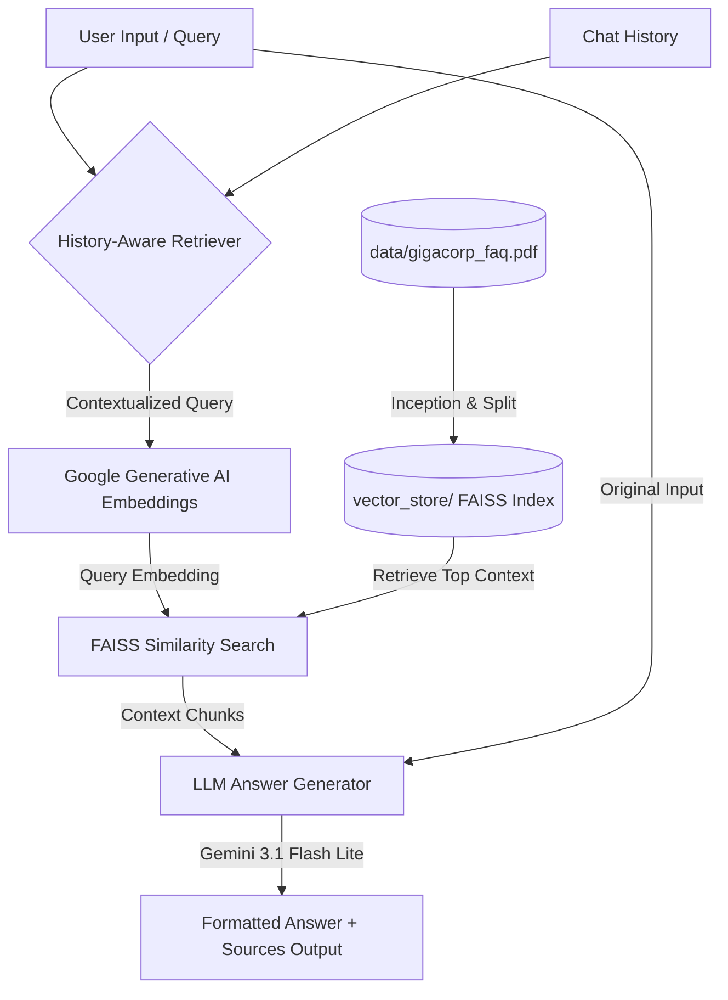

# 🤖 GigaCorp Customer Support RAG Agent

A self-contained, modular Customer Support RAG Agent designed for **GigaCorp**. This project is built using LangChain, FAISS, Google's Gemini LLM, and Sentence Transformers to create an interactive QA chatbot with chat memory and precise page-level source citations.

---

## 🚀 Live Demo

Try the deployed application:
https://customer-support-rag-agent.onrender.com

The application is deployed on Render.

---

## 🏗️ Architecture Overview

The system operates as a Retrieval-Augmented Generation (RAG) agent that matches user queries with relevant sections of a local GigaCorp product handbook PDF and formats responses via a Gemini LLM.



1. **Document Loading & Splitting**: On the first start, `generate_faq_pdf.py` creates `data/gigacorp_faq.pdf`. The document loader `PyPDFLoader` parses the pages, and `RecursiveCharacterTextSplitter` breaks them down into 500-character chunks with 50-character overlap.
2. **Indexing & Vector DB**: Standardized embeddings are generated using `models/gemini-embedding-001` via `GoogleGenerativeAIEmbeddings` (outputting 3072 dimensions) and cached locally in a `FAISS` vector store.
3. **Conversational Memory**: A `create_history_aware_retriever` combines previous conversation turns with the current question to rewrite vague inputs (e.g., "how much does it cost?") into standalone, context-aware retrieval queries.
4. **Retrieval & Verification**: Chunks matching the rewritten query are retrieved. The system programmatically double-checks the FAISS index dimension against the active embeddings model dimension. If a mismatch occurs, it safely wipes the old store and compiles a fresh one.
5. **Generation**: The context chunks, chat history, and prompt are sent to `ChatGoogleGenerativeAI` utilizing the `gemini-3.1-flash-lite` model. The model generates a persona-aligned response strictly restricted to the mock FAQ content.
6. **Citations extraction**: The metadata from the returned context chunks is mapped directly beneath the assistant's response to output file and page citations dynamically.

---

## 📂 Project Structure

```text
Customer-Support-RAG-Agent/
│
├── .env.example               # Template for your local environment variables
├── requirements.txt           # Project package dependencies
├── README.md                  # Comprehensive setup and guide (this file)
├── generate_faq_pdf.py        # Python script to compile the mock GigaCorp FAQ PDF
├── rag_pipeline.py            # RAG backend (FAISS index setup, similarity lookup, QA chain)
└── app.py                     # Streamlit frontend (Chat UI, session state, citations layout)
│
├── data/                      # PDF manual files
│   └── gigacorp_faq.pdf       # Local FAQ handbook (Auto-generated on startup)
│
└── vector_store/              # Saved vector index binaries (Auto-created on startup)
    ├── index.faiss            # FAISS index binary
    └── index.pkl              # FAISS index metadata pickle
```

---

## 🚀 Key Features

1. **Self-Bootstrapping**: On its very first launch, the app automatically compiles a multi-page, formatted FAQ document (`data/gigacorp_faq.pdf`) and processes it into a persistent local vector database (`vector_store/`).
2. **Conversational Memory**: Built using LangChain's `create_history_aware_retriever`. The chatbot tracks historical queries and correctly understands follow-up questions referencing past messages.
3. **Guardrails & Persona Alignment**: The agent is programmed to act strictly as a representative for GigaCorp. It answers questions solely based on the provided PDF context and politely declines out-of-scope queries (e.g. general knowledge, programming, or recipes).
4. **Source Citations**: Answers automatically cite their sources, extracting the matching PDF page numbers (1-indexed) and corresponding raw segments.

---

## 🛠️ Setup Instructions

### 1. Configure the Environment
Clone or navigate to the project directory:
```bash
cd Customer-Support-RAG-Agent
```

Create a `.env` file in the project root:
```bash
cp .env.example .env
```
Open `.env` and fill in your Gemini API key:
```env
# Google Gemini API Key (either variable is supported)
GEMINI_API_KEY=your_api_key_here
# GOOGLE_API_KEY=your_api_key_here

# Optional: Override default models (defaults to working gemini-3.1-flash-lite)
# GEMINI_LLM_MODEL=gemini-3.1-flash-lite
# GEMINI_EMBEDDING_MODEL=models/gemini-embedding-001
```

### 2. Install Dependencies
Install all required libraries:
```bash
pip install -r requirements.txt
```

### 3. Launch the Application
Run the Streamlit application. The app will automatically run `generate_faq_pdf.py` to create the mock FAQ PDF, build the FAISS index, and start the local web server:
```bash
streamlit run app.py
```
Streamlit will launch a local server and open the web dashboard in your browser.
